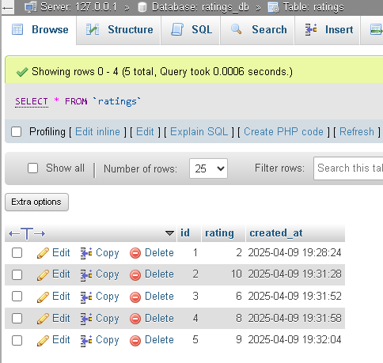

# Feedback Modal Widget

This is a simple, responsive feedback modal widget built using **HTML**, **CSS**, and **JavaScript**. It allows users to rate a service (like FrontendPro) from 1 to 10 and submit their feedback via a clean and modern UI.

---

## 🔧 Features

- One-click feedback prompt
- Clean, centered modal overlay
- Interactive rating scale (1 to 10)
- Visual selection with highlight effect
- Cancel and Submit actions
- Responsive design with smooth UX
- External CSS and JavaScript separation for better maintainability
- **MySQL integration to store feedback**

---

## 📂 Project Structure

---

## 📸 Screenshots

### Modal Closed  

### Modal Active  

### MySQL Database  

---

## 🚀 How to Use

1. **Clone or Download** this repository.

2. **Open `index.html`** in your browser:
   - Click the "Give Feedback" button.
   - Choose a rating from 1 to 10.
   - Click **Submit** or **Cancel**.

3. Ensure you have a local MySQL database named `feedback_db` and a table named `feedback` with a `rating` column.

4. PHP backend (`submit_rating.php`) handles data storage via AJAX.

---

## 🛠️ Customization

- Change styles in `styles.css`
- Modify text in `index.html`
- Adjust or extend backend logic in `submit_rating.php`

---

## 📦 Dependencies

No external libraries – built with HTML, CSS, and vanilla JavaScript.

---
