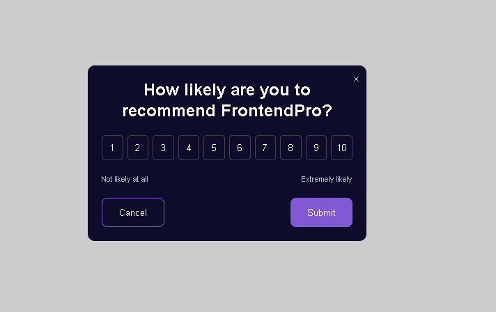
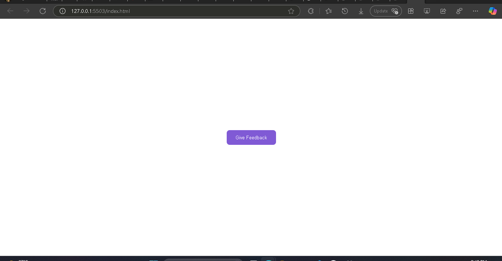
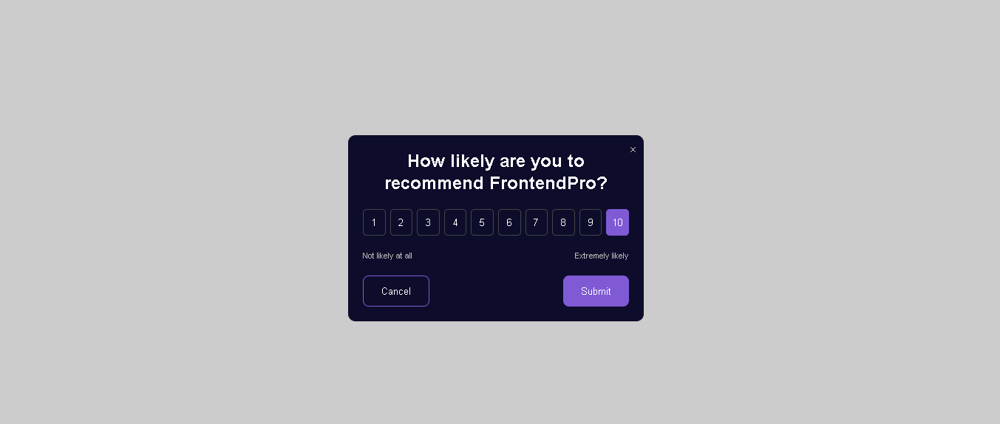

# Feedback Modal Widget

This is a simple, responsive feedback modal widget built using **HTML**, **CSS**, and **JavaScript**. It allows users to rate a service (like FrontendPro) from 1 to 10 and submit their feedback via a clean and modern UI.

---

## 🔧 Features

- One-click feedback prompt
- Clean, centered modal overlay
- Interactive rating scale (1 to 10)
- Visual selection with highlight effect
- Cancel and Submit actions
- Responsive design with smooth UX
- External CSS and JavaScript separation for better maintainability

---

## 📂 Project Structure

---

## 📸 Screenshots

### Modal Closed  

### Modal Active  

---

## 🚀 How to Use

1. **Clone or Download** this repository.

2. **Open `index.html`** in your browser:
   - Click the "Give Feedback" button to open the modal.
   - Choose a rating from 1 to 10.
   - Click **Submit** or **Cancel**.

3. To include this modal in your project:
   - Copy `index.html` content into your own page.
   - Include links to `styles.css` and `script.js`.
   - Make sure the file paths are correct.

---

## 🛠️ Customization

- **Change colors** in `styles.css` to match your brand.
- Modify the **modal text/question** directly in the `index.html`.
- Extend functionality with backend integration (e.g., saving feedback).

---

## 📦 Dependencies

This widget uses **no external libraries** – pure HTML, CSS, and vanilla JavaScript.

---
